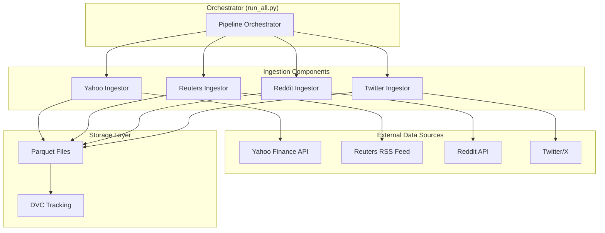

# Design Document: Financial Data Ingestion Pipeline

## Overview

The financial data ingestion pipeline is a Python-based system that collects market data and sentiment signals from multiple sources for machine learning applications. The pipeline orchestrates four independent ingestion components that retrieve data from Yahoo Finance (OHLCV), Reuters RSS (news), Reddit (social sentiment), and Twitter/X (cashtag mentions). All data is stored in Parquet format with DVC version control, and the system is designed for idempotent execution with comprehensive error handling.

### Design Goals

1. **Modularity**: Each data source has an independent ingestor that can be executed standalone or as part of the orchestrated pipeline
2. **Idempotency**: Re-running the pipeline produces consistent results without data duplication through timestamp-based file naming
3. **Resilience**: Individual ingestor failures do not cascade; the pipeline continues processing remaining sources
4. **Observability**: Comprehensive logging at all stages enables debugging and monitoring
5. **Reproducibility**: DVC tracking and pinned dependencies ensure experiments can be reproduced
6. **Security**: Environment-based configuration prevents credential exposure in source code

### Technology Stack

- **Language**: Python 3.8+
- **Data Libraries**: pandas, pyarrow (Parquet I/O)
- **API Clients**: yfinance (Yahoo Finance), feedparser (RSS), PRAW (Reddit), snscrape (Twitter)
- **Configuration**: python-dotenv
- **Version Control**: DVC (Data Version Control)
- **Logging**: Python standard library logging module

## Architecture

### High-Level Architecture



### Component Architecture

Each ingestor follows a consistent pattern:

1. **Configuration Loading**: Read credentials and parameters from environment variables
2. **Data Retrieval**: Call external API/service to fetch data
3. **Data Transformation**: Add metadata columns (ingested_at, source identifiers)
4. **Data Persistence**: Write to Parquet with timestamp-based filename
5. **Error Handling**: Log errors and exit gracefully on failure

### Directory Structure

```
financial-data-ingestion-pipeline/
├── .env                          # Environment variables (not in Git)
├── .gitignore                    # Git exclusions
├── requirements.txt              # Python dependencies
├── dvc.yaml                      # DVC configuration
├── .dvc/                         # DVC metadata
├── data/
│   └── raw/                      # Raw ingested data (DVC tracked)
│       ├── yahoo/                # Yahoo Finance OHLCV data
│       │   └── {ticker}_{YYYYMMDD_HH}.parquet
│       ├── reuters/              # Reuters news articles
│       │   └── reuters_{YYYYMMDD_HH}.parquet
│       ├── reddit/               # Reddit posts
│       │   └── reddit_{YYYYMMDD_HH}.parquet
│       └── twitter/              # Twitter cashtag mentions
│           └── twitter_{YYYYMMDD_HH}.parquet
└── src/
    └── ingestion/
        ├── __init__.py
        ├── run_all.py            # Orchestrator script
        ├── yahoo_ingest.py       # Yahoo Finance ingestor
        ├── reuters_ingest.py     # Reuters RSS ingestor
        ├── reddit_ingest.py      # Reddit ingestor
        ├── twitter_ingest.py     # Twitter ingestor
        └── utils.py              # Shared utilities (logging, file ops)
```

## Components and Interfaces

### 1. Yahoo Finance Ingestor (`yahoo_ingest.py`)

**Purpose**: Retrieve hourly OHLCV data for specified tickers from Yahoo Finance.

**Interface**:
```python
def ingest_yahoo_data(tickers: List[str], interval: str = "1h", period: str = "60d") -> None:
    """
    Ingest OHLCV data from Yahoo Finance for specified tickers.
    
    Args:
        tickers: List of ticker symbols (e.g., ["AAPL", "TSLA", "SPY"])
        interval: Data interval (default: "1h")
        period: Lookback period (default: "60d")
    
    Raises:
        Exception: Logs error and continues if individual ticker fails
    """
```

**Key Operations**:
1. For each ticker in `["AAPL", "TSLA", "SPY"]`:
   - Call `yfinance.Ticker(ticker).history(period="60d", interval="1h")`
   - Add `ticker` column with symbol
   - Add `ingested_at` column with ISO 8601 timestamp
   - Write to `data/raw/yahoo/{ticker}_{YYYYMMDD_HH}.parquet`
2. Handle API errors per ticker without stopping pipeline
3. Log start, completion (with row count), and errors

**Dependencies**: yfinance, pandas, pyarrow

### 2. Reuters RSS Ingestor (`reuters_ingest.py`)

**Purpose**: Scrape business news articles from Reuters RSS feed.

**Interface**:
```python
def ingest_reuters_feed(feed_url: str = "http://feeds.reuters.com/reuters/businessNews") -> None:
    """
    Ingest articles from Reuters RSS feed.
    
    Args:
        feed_url: RSS feed URL (default: Reuters business news)
    
    Raises:
        Exception: Logs error and exits if feed unavailable
    """
```

**Key Operations**:
1. Parse RSS feed using `feedparser.parse(feed_url)`
2. Extract fields: `title`, `link`, `published_date`
3. Add `ingested_at` column with ISO 8601 timestamp
4. Write to `data/raw/reuters/reuters_{YYYYMMDD_HH}.parquet`
5. Exit gracefully if feed unavailable

**Dependencies**: feedparser, pandas, pyarrow

### 3. Reddit Ingestor (`reddit_ingest.py`)

**Purpose**: Collect top posts from investment-focused subreddits.

**Interface**:
```python
def ingest_reddit_posts(subreddits: List[str], limit: int = 100) -> None:
    """
    Ingest top posts from specified subreddits.
    
    Args:
        subreddits: List of subreddit names (e.g., ["investing", "stocks", "wallstreetbets"])
        limit: Number of top posts to retrieve per subreddit (default: 100)
    
    Raises:
        Exception: Logs error and exits if authentication fails
    """
```

**Key Operations**:
1. Authenticate with Reddit API using PRAW:
   ```python
   reddit = praw.Reddit(
       client_id=os.getenv("REDDIT_CLIENT_ID"),
       client_secret=os.getenv("REDDIT_CLIENT_SECRET"),
       user_agent=os.getenv("REDDIT_USER_AGENT")
   )
   ```
2. For each subreddit in `["investing", "stocks", "wallstreetbets"]`:
   - Retrieve top 100 posts: `reddit.subreddit(name).top(limit=100)`
   - Extract: `title`, `selftext`, `created_utc`, `score`, `num_comments`
   - Add `subreddit` column
3. Add `ingested_at` column with ISO 8601 timestamp
4. Write to `data/raw/reddit/reddit_{YYYYMMDD_HH}.parquet`
5. Exit gracefully if authentication fails

**Dependencies**: praw, pandas, pyarrow, python-dotenv

### 4. Twitter Ingestor (`twitter_ingest.py`)

**Purpose**: Scrape tweets containing stock cashtags.

**Interface**:
```python
def ingest_twitter_cashtags(cashtags: List[str], limit: int = 100) -> None:
    """
    Ingest tweets containing specified cashtags.
    
    Args:
        cashtags: List of cashtags (e.g., ["$AAPL", "$TSLA"])
        limit: Maximum tweets per cashtag (default: 100)
    
    Raises:
        Exception: Logs error and continues if individual cashtag fails
    """
```

**Key Operations**:
1. For each cashtag in `["$AAPL", "$TSLA"]`:
   - Scrape tweets using snscrape: `sntwitter.TwitterSearchScraper(cashtag)`
   - Extract: `text`, `created_at`, `likes`, `retweets`
   - Add `cashtag` column
2. Add `ingested_at` column with ISO 8601 timestamp
3. Write to `data/raw/twitter/twitter_{YYYYMMDD_HH}.parquet`
4. Handle scraping errors per cashtag without stopping

**Dependencies**: snscrape, pandas, pyarrow

### 5. Pipeline Orchestrator (`run_all.py`)

**Purpose**: Execute all ingestors in sequence with comprehensive error handling.

**Interface**:
```python
def run_pipeline() -> Dict[str, bool]:
    """
    Execute all ingestion components.
    
    Returns:
        Dictionary mapping ingestor name to success status
    """
```

**Key Operations**:
1. Log pipeline start time
2. Execute ingestors in sequence:
   - `ingest_yahoo_data()`
   - `ingest_reuters_feed()`
   - `ingest_reddit_posts()`
   - `ingest_twitter_cashtags()`
3. Wrap each ingestor call in try-except to isolate failures
4. Log each ingestor's success/failure status
5. Log pipeline end time and summary (successful/failed counts)

**Error Handling Strategy**:
- Individual ingestor failures are logged but do not stop the pipeline
- Each ingestor returns success/failure status
- Final summary reports overall pipeline health

### 6. Shared Utilities (`utils.py`)

**Purpose**: Provide common functionality across ingestors.

**Functions**:

```python
def setup_logging(component_name: str) -> logging.Logger:
    """
    Configure logging for a component.
    
    Args:
        component_name: Name to include in log messages
    
    Returns:
        Configured logger instance
    """

def ensure_directory_exists(path: str) -> None:
    """
    Create directory if it doesn't exist.
    
    Args:
        path: Directory path to create
    """

def get_timestamp_filename(source: str, extension: str = "parquet") -> str:
    """
    Generate timestamp-based filename for idempotent writes.
    
    Args:
        source: Data source name (e.g., "yahoo", "reuters")
        extension: File extension (default: "parquet")
    
    Returns:
        Filename in format {source}_{YYYYMMDD_HH}.{extension}
    """

def save_to_parquet(df: pd.DataFrame, filepath: str) -> None:
    """
    Save DataFrame to Parquet with Snappy compression.
    
    Args:
        df: DataFrame to save
        filepath: Output file path
    
    Raises:
        Exception: Logs error if write fails
    """
```

## Data Models

### Yahoo Finance OHLCV Schema

| Column | Type | Description |
|--------|------|-------------|
| `datetime` | datetime64[ns] | Timestamp of the OHLCV bar (index) |
| `open` | float64 | Opening price |
| `high` | float64 | Highest price in interval |
| `low` | float64 | Lowest price in interval |
| `close` | float64 | Closing price |
| `volume` | int64 | Trading volume |
| `ticker` | string | Stock ticker symbol (e.g., "AAPL") |
| `ingested_at` | string | ISO 8601 timestamp of ingestion |

**File Naming**: `data/raw/yahoo/{ticker}_{YYYYMMDD_HH}.parquet`

**Example**: `data/raw/yahoo/AAPL_20240115_14.parquet`

### Reuters RSS Article Schema

| Column | Type | Description |
|--------|------|-------------|
| `title` | string | Article headline |
| `link` | string | URL to full article |
| `published_date` | string | Publication timestamp from RSS |
| `ingested_at` | string | ISO 8601 timestamp of ingestion |

**File Naming**: `data/raw/reuters/reuters_{YYYYMMDD_HH}.parquet`

**Example**: `data/raw/reuters/reuters_20240115_14.parquet`

### Reddit Post Schema

| Column | Type | Description |
|--------|------|-------------|
| `title` | string | Post title |
| `selftext` | string | Post body text |
| `created_utc` | int64 | Unix timestamp of post creation |
| `score` | int64 | Upvote score |
| `num_comments` | int64 | Number of comments |
| `subreddit` | string | Source subreddit (e.g., "investing") |
| `ingested_at` | string | ISO 8601 timestamp of ingestion |

**File Naming**: `data/raw/reddit/reddit_{YYYYMMDD_HH}.parquet`

**Example**: `data/raw/reddit/reddit_20240115_14.parquet`

### Twitter Cashtag Schema

| Column | Type | Description |
|--------|------|-------------|
| `text` | string | Tweet content |
| `created_at` | string | Tweet timestamp |
| `likes` | int64 | Like count |
| `retweets` | int64 | Retweet count |
| `cashtag` | string | Search cashtag (e.g., "$AAPL") |
| `ingested_at` | string | ISO 8601 timestamp of ingestion |

**File Naming**: `data/raw/twitter/twitter_{YYYYMMDD_HH}.parquet`

**Example**: `data/raw/twitter/twitter_20240115_14.parquet`

## Error Handling

### Error Handling Strategy

The pipeline implements a **fail-fast per component, continue pipeline** strategy:

1. **Network Errors**: Log error with details, continue to next item/component
2. **API Rate Limits**: Log warning with rate limit details, exit component gracefully
3. **Authentication Failures**: Log error, exit component gracefully
4. **File I/O Errors**: Log error with file path, exit component gracefully
5. **Parsing Errors**: Log error with problematic data, skip item and continue

### Error Handling Patterns

**Pattern 1: Per-Item Error Handling (Yahoo, Twitter)**
```python
for ticker in tickers:
    try:
        # Fetch and process data
        data = fetch_data(ticker)
        save_data(data)
    except Exception as e:
        logger.error(f"Failed to process {ticker}: {e}", exc_info=True)
        continue  # Continue with next ticker
```

**Pattern 2: Component-Level Error Handling (Reuters, Reddit)**
```python
try:
    # Fetch and process all data
    data = fetch_all_data()
    save_data(data)
except Exception as e:
    logger.error(f"Component failed: {e}", exc_info=True)
    return False  # Exit component, orchestrator continues
```

**Pattern 3: Orchestrator Error Isolation**
```python
results = {}
for ingestor_name, ingestor_func in ingestors:
    try:
        ingestor_func()
        results[ingestor_name] = True
    except Exception as e:
        logger.error(f"{ingestor_name} failed: {e}", exc_info=True)
        results[ingestor_name] = False
        # Continue with next ingestor
```

### Logging Standards

**Log Levels**:
- `INFO`: Normal operations (start, completion, row counts)
- `WARNING`: Recoverable issues (rate limits, missing optional data)
- `ERROR`: Failures (API errors, authentication failures, I/O errors)

**Log Format**:
```
%(asctime)s - %(name)s - %(levelname)s - %(message)s
```

**Required Log Events**:
1. Component start: `logger.info(f"Starting {component_name} ingestion")`
2. Component completion: `logger.info(f"Completed {component_name}: {row_count} rows")`
3. Errors: `logger.error(f"Error in {component_name}: {error}", exc_info=True)`
4. Pipeline summary: `logger.info(f"Pipeline complete: {success_count}/{total_count} successful")`

## Configuration Management

### Environment Variables

**Required Variables**:
- `REDDIT_CLIENT_ID`: Reddit API client ID
- `REDDIT_CLIENT_SECRET`: Reddit API client secret
- `REDDIT_USER_AGENT`: Reddit API user agent string

**Optional Variables**:
- Twitter credentials (if required by snscrape version)

### .env File Format

```bash
# Reddit API Credentials
REDDIT_CLIENT_ID=your_client_id_here
REDDIT_CLIENT_SECRET=your_client_secret_here
REDDIT_USER_AGENT=financial-data-pipeline:v1.0 (by /u/yourusername)

# Twitter API Credentials (if needed)
# TWITTER_BEARER_TOKEN=your_token_here
```

### Configuration Loading

```python
from dotenv import load_dotenv
import os

# Load environment variables
load_dotenv()

# Validate required variables
required_vars = ["REDDIT_CLIENT_ID", "REDDIT_CLIENT_SECRET", "REDDIT_USER_AGENT"]
missing_vars = [var for var in required_vars if not os.getenv(var)]

if missing_vars:
    logger.error(f"Missing required environment variables: {missing_vars}")
    raise EnvironmentError(f"Missing variables: {missing_vars}")
```

## Idempotency Design

### Timestamp-Based File Naming

**Strategy**: Use hour-granularity timestamps in filenames to partition data by execution time.

**Format**: `{source}_{YYYYMMDD_HH}.parquet`

**Examples**:
- `yahoo/AAPL_20240115_14.parquet` (Yahoo data for AAPL at 2024-01-15 14:00)
- `reuters_20240115_14.parquet` (Reuters data at 2024-01-15 14:00)

**Idempotency Guarantee**:
- Multiple executions within the same hour overwrite the same file
- No duplicate data accumulation
- Each file represents a snapshot of data at that hour

### Implementation

```python
from datetime import datetime

def get_timestamp_filename(source: str, ticker: str = None) -> str:
    """Generate timestamp-based filename."""
    timestamp = datetime.now().strftime("%Y%m%d_%H")
    
    if ticker:
        return f"{ticker}_{timestamp}.parquet"
    else:
        return f"{source}_{timestamp}.parquet"
```

**Write Strategy**:
- Use `df.to_parquet(path, mode='overwrite')` to replace existing files
- Ensure atomic writes (write to temp file, then rename)

## Data Version Control (DVC)

### DVC Configuration

**dvc.yaml**:
```yaml
# DVC pipeline configuration
stages:
  ingest:
    cmd: python src/ingestion/run_all.py
    deps:
      - src/ingestion/
    outs:
      - data/raw/:
          cache: true
          persist: false
```

**DVC Tracking Setup**:
```bash
# Initialize DVC
dvc init

# Track raw data directory
dvc add data/raw/

# Commit DVC metadata to Git
git add data/raw.dvc .dvc/config .dvc/.gitignore
git commit -m "Add DVC tracking for raw data"
```

### .gitignore Configuration

```
# Environment variables
.env

# Data files (tracked by DVC)
/data/raw/

# Python
__pycache__/
*.pyc
*.pyo
*.egg-info/

# DVC
/data/raw/.dvc/
```

## Testing Strategy

### Testing Approach

This pipeline is **not suitable for property-based testing** because:
1. Core functionality involves external API calls and I/O operations
2. Behavior is primarily side-effect driven (fetching data, writing files)
3. Testing requires extensive mocking of external services
4. Integration tests and example-based unit tests provide better coverage

### Test Categories

#### 1. Unit Tests (with Mocking)

**Purpose**: Test individual ingestor logic in isolation.

**Approach**:
- Mock external API calls (yfinance, feedparser, PRAW, snscrape)
- Test data transformation logic (adding columns, timestamp generation)
- Test error handling paths
- Test filename generation and directory creation

**Example Test Cases**:
```python
# Test: Yahoo ingestor adds required columns
def test_yahoo_adds_metadata_columns(mock_yfinance):
    mock_yfinance.Ticker.return_value.history.return_value = sample_ohlcv_df
    ingest_yahoo_data(["AAPL"])
    
    # Verify output file contains ticker and ingested_at columns
    df = pd.read_parquet("data/raw/yahoo/AAPL_*.parquet")
    assert "ticker" in df.columns
    assert "ingested_at" in df.columns

# Test: Reuters ingestor handles feed unavailable
def test_reuters_handles_unavailable_feed(mock_feedparser):
    mock_feedparser.parse.side_effect = ConnectionError("Feed unavailable")
    
    result = ingest_reuters_feed()
    assert result == False  # Graceful exit

# Test: Reddit ingestor handles auth failure
def test_reddit_handles_auth_failure(mock_praw):
    mock_praw.Reddit.side_effect = praw.exceptions.PRAWException("Auth failed")
    
    result = ingest_reddit_posts(["investing"])
    assert result == False  # Graceful exit

# Test: Timestamp filename generation
def test_timestamp_filename_format():
    filename = get_timestamp_filename("yahoo", "AAPL")
    assert re.match(r"AAPL_\d{8}_\d{2}\.parquet", filename)
```

#### 2. Integration Tests

**Purpose**: Test end-to-end data flow with real APIs (in test environment).

**Approach**:
- Use test credentials and small data samples
- Verify actual API connectivity
- Verify file creation and Parquet format
- Verify DVC tracking

**Example Test Cases**:
```python
# Test: End-to-end Yahoo ingestion
def test_yahoo_integration():
    ingest_yahoo_data(["AAPL"], period="1d")  # Small sample
    
    # Verify file exists
    files = glob.glob("data/raw/yahoo/AAPL_*.parquet")
    assert len(files) > 0
    
    # Verify Parquet format and schema
    df = pd.read_parquet(files[0])
    assert "ticker" in df.columns
    assert df["ticker"].iloc[0] == "AAPL"

# Test: Orchestrator executes all ingestors
def test_orchestrator_runs_all_ingestors():
    results = run_pipeline()
    
    # Verify all ingestors were attempted
    assert "yahoo" in results
    assert "reuters" in results
    assert "reddit" in results
    assert "twitter" in results
```

#### 3. Idempotency Tests

**Purpose**: Verify re-running pipeline produces consistent results.

**Approach**:
- Run ingestor twice within same hour
- Verify only one file exists (overwrite behavior)
- Verify file content is consistent

**Example Test Cases**:
```python
# Test: Multiple runs within same hour overwrite
def test_idempotent_execution():
    # First run
    ingest_yahoo_data(["AAPL"])
    files_after_first = glob.glob("data/raw/yahoo/AAPL_*.parquet")
    
    # Second run (same hour)
    ingest_yahoo_data(["AAPL"])
    files_after_second = glob.glob("data/raw/yahoo/AAPL_*.parquet")
    
    # Should have same number of files (overwrite, not append)
    assert len(files_after_first) == len(files_after_second)
```

#### 4. Error Handling Tests

**Purpose**: Verify graceful degradation and error logging.

**Approach**:
- Simulate API failures, network errors, rate limits
- Verify errors are logged with appropriate level
- Verify pipeline continues after individual failures

**Example Test Cases**:
```python
# Test: Orchestrator continues after ingestor failure
def test_orchestrator_continues_after_failure(mock_yahoo, mock_reuters):
    mock_yahoo.side_effect = Exception("Yahoo API down")
    mock_reuters.return_value = True  # Reuters succeeds
    
    results = run_pipeline()
    
    assert results["yahoo"] == False
    assert results["reuters"] == True  # Continued despite Yahoo failure

# Test: Error logging includes traceback
def test_error_logging_includes_traceback(caplog):
    with pytest.raises(Exception):
        ingest_yahoo_data(["INVALID_TICKER"])
    
    assert "Traceback" in caplog.text
```

### Test Execution

**Test Framework**: pytest

**Test Organization**:
```
tests/
├── unit/
│   ├── test_yahoo_ingest.py
│   ├── test_reuters_ingest.py
│   ├── test_reddit_ingest.py
│   ├── test_twitter_ingest.py
│   └── test_utils.py
├── integration/
│   ├── test_yahoo_integration.py
│   ├── test_orchestrator.py
│   └── test_dvc_tracking.py
└── conftest.py  # Shared fixtures and mocks
```

**Running Tests**:
```bash
# Run all tests
pytest tests/

# Run unit tests only
pytest tests/unit/

# Run integration tests only
pytest tests/integration/

# Run with coverage
pytest --cov=src/ingestion tests/
```

### Test Coverage Goals

- **Unit Tests**: 80%+ code coverage for ingestor logic
- **Integration Tests**: Cover all external API interactions
- **Error Paths**: Test all error handling branches
- **Idempotency**: Verify overwrite behavior for all ingestors

## Implementation Notes

### Dependency Versions

**requirements.txt**:
```
# Data manipulation
pandas>=1.5.0,<2.0.0
pyarrow>=10.0.0,<11.0.0

# API clients
yfinance>=0.2.0,<0.3.0
feedparser>=6.0.0,<7.0.0
praw>=7.6.0,<8.0.0
snscrape>=0.6.0,<0.7.0

# Configuration
python-dotenv>=1.0.0,<2.0.0

# Data version control
dvc>=3.0.0,<4.0.0

# Testing
pytest>=7.0.0,<8.0.0
pytest-cov>=4.0.0,<5.0.0
pytest-mock>=3.10.0,<4.0.0
```

### Parquet Configuration

**Compression**: Snappy (default in pyarrow)
- Good balance of compression ratio and speed
- Wide compatibility with analytics tools

**Write Options**:
```python
df.to_parquet(
    path,
    engine='pyarrow',
    compression='snappy',
    index=True  # Preserve datetime index for Yahoo data
)
```

### Execution Flow

**Manual Execution**:
```bash
# Set up environment
python -m venv venv
source venv/bin/activate  # or venv\Scripts\activate on Windows
pip install -r requirements.txt

# Configure credentials
cp .env.example .env
# Edit .env with your credentials

# Run pipeline
python src/ingestion/run_all.py
```

**Scheduled Execution** (cron example):
```bash
# Run every hour
0 * * * * cd /path/to/project && /path/to/venv/bin/python src/ingestion/run_all.py >> logs/pipeline.log 2>&1
```

### Performance Considerations

1. **Yahoo Finance**: Rate limits vary; implement exponential backoff if needed
2. **Reuters RSS**: Typically fast, but feed may be temporarily unavailable
3. **Reddit API**: Rate limit of 60 requests per minute; 3 subreddits × 100 posts is well within limits
4. **Twitter Scraping**: snscrape has no official rate limits but may be throttled; implement delays if needed

**Estimated Execution Time**: 2-5 minutes for full pipeline (depends on network and API response times)

### Security Considerations

1. **Credential Storage**: Never commit .env file to Git
2. **API Keys**: Use read-only credentials where possible
3. **Data Privacy**: Ensure compliance with API terms of service for data storage
4. **Rate Limiting**: Respect API rate limits to avoid account suspension

### Monitoring and Alerting

**Recommended Monitoring**:
1. Parse logs for ERROR level messages
2. Track pipeline execution time (alert if exceeds threshold)
3. Monitor data freshness (alert if no new files in expected timeframe)
4. Track file sizes (alert on unexpected size changes)

**Log Aggregation**:
- Consider using structured logging (JSON format) for easier parsing
- Integrate with log aggregation tools (e.g., ELK stack, CloudWatch Logs)

## Future Enhancements

1. **Incremental Ingestion**: Track last ingestion timestamp to fetch only new data
2. **Data Quality Checks**: Add validation for schema, null values, outliers
3. **Retry Logic**: Implement exponential backoff for transient failures
4. **Parallel Execution**: Run ingestors concurrently using multiprocessing
5. **Data Transformation Pipeline**: Add feature engineering stage after ingestion
6. **API Abstraction Layer**: Create unified interface for all data sources
7. **Metrics Collection**: Track ingestion metrics (row counts, execution time, error rates)
8. **Alerting Integration**: Send notifications on pipeline failures
